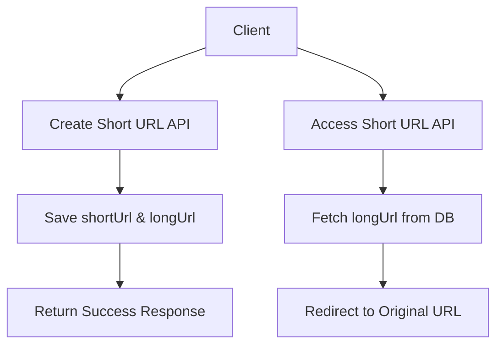
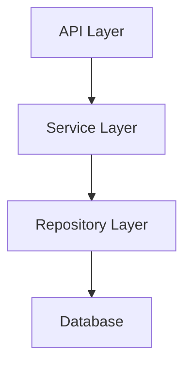
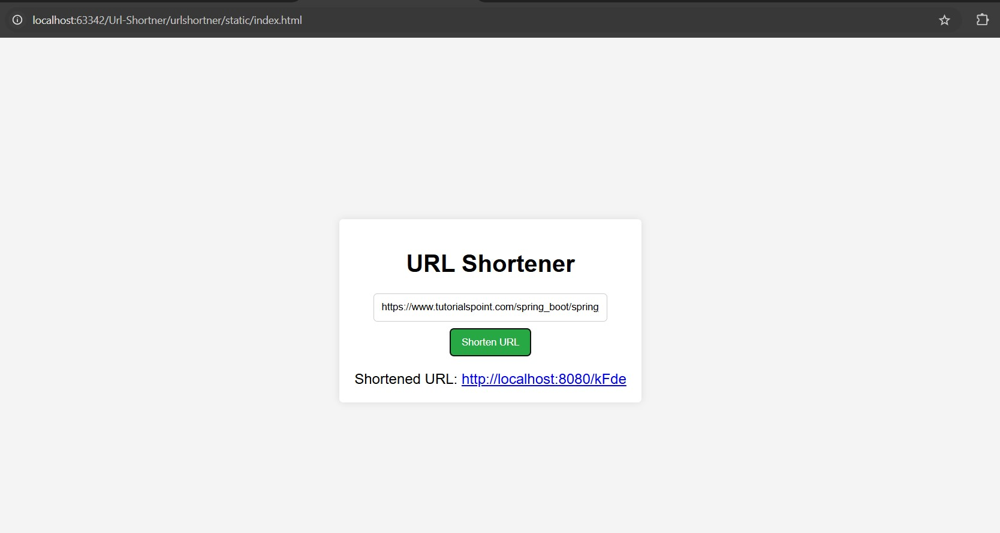

# Url-Shortner

## Project Overview
Url-Shortener is a simple web application that allows users to create short, easy-to-share URLs for long and complex web links. The application provides APIs for saving and retrieving URLs along with seamless redirection functionality.

## Features
- Generate and manage short URLs for long web links.
- Fast redirection from short URLs to original links.
- REST API-based endpoints for easy integration.
- Lightweight and scalable application design.
- Detailed logs for easy monitoring.

## Technology Stack
- **Language**: Java 18
- **Frameworks**: Jakarta EE, Spring MVC, Spring Data JPA
- **Libraries**: Lombok
- **Database**: H2 (In-memory database)
- **Build Tool**: Maven

## Setup Instructions
1. Clone the repository:
   ```bash
   git clone https://github.com/your-repo/url-shortener.git
   cd url-shortener
   ```
2. Open the project in an IDE (e.g., IntelliJ IDEA).
3. Ensure Java 18 and Maven are installed on your system.
4. Build the project:
   ```bash
   mvn clean install
   ```
5. Run the application:
   ```bash
   mvn spring-boot:run
   ```
6. The application will start at `http://localhost:8080`.

## Usage Guide
1. **Create a Short URL**
   - Endpoint: `POST /create`
   - Request Body:
     ```json
     {
       "shortUrl": "qwerty1",
       "longUrl": "https://google.com"
     }
     ```
   - Response: A success message or error details.

2. **Use a Short URL**
   - Endpoint: `GET /{shortUrl}`
   - Replace `{shortUrl}` with your generated short URL (e.g., `qwerty1`).
   - Response: Redirects to the original URL.

## Mermaid Diagrams
### Application Flow Diagram


### Database Interaction Flow


## Result


